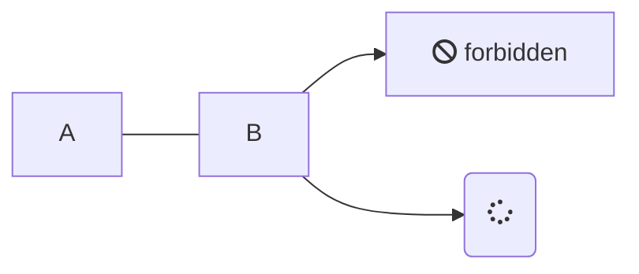

> HTML Learing


前端学习路线图

* [Frontend Developer](https://roadmap.sh/frontend)

---


- [1.Internet](#1internet)
- [2.HTML](#2html)
- [3.CSS](#3css)
- [4.JavaScript](#4javascript)
- [5.Version Control System](#5version-control-system)


---

## 1.Internet


* [1] DNS and how it works?

```markdown
DNS代表域名系统。它是一个用于将域名（例如example.com）转换为计算机可以理解的IP地址的系统。

当您在Web浏览器中键入网站地址，例如www.example.com时，您计算机上的DNS解析程序会向DNS服务器发送请求，
请求与该域名关联的IP地址。然后，DNS服务器使用托管网站的服务器的IP地址响应。

DNS系统的工作方式类似于分布式数据库，全球范围内有数百万个DNS服务器。当DNS服务器收到域名请求时，
它首先检查自己的缓存是否已经具有该域名的IP地址。如果没有，它会查询其他DNS服务器，直到找到正确的IP地址。

DNS还支持不同类型的记录，包括A记录（将域名映射到IP地址）、MX记录（指定域的邮件服务器）和
CNAME记录（允许一个域名是另一个域名的别名）。

总体而言，DNS通过提供一种将人可读的域名转换为计算机可读的IP地址的方式，发挥着使互联网正常运行的关键作用。
```





<html lang="en">
  <body>
    <pre class="mermaid">
  graph LR
      A --- B
      B-->C[fa:fa-ban forbidden]
      B-->D(fa:fa-spinner);
    </pre>
    <script type="module">
      import mermaid from 'https://cdn.jsdelivr.net/npm/mermaid@10/dist/mermaid.esm.min.mjs';
    </script>
  </body>
</html>


## 2.HTML


## 3.CSS


## 4.JavaScript


## 5.Version Control System 
